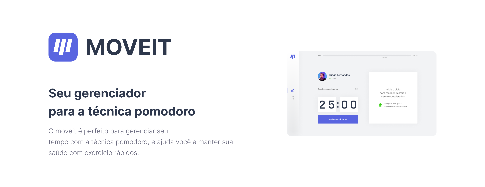

<h2 style="text-align:center;">
 🚧 React Select 🚀 Under construction... 🚧
</h2>
<h3 style="text-align:center;">


</h3>
<h1 style="display:flex; align-items:center;">
   <b style="margin-left: 4px;">Move.it</b>
</h1>

## **Table of Contents**

- [About](#About)
- [How to Use](#How-to-Use)
  - [Prerequisites](#prerequisites)
  - [Start the Application](#start-the-application)
- [Technologies Used](#technologies-used)
- [Author](#author)
- [License](#license)

## **About**

Move.it is here to help you manage your time using the Pomodoro technique. Every 25 minutes, it sends you a notification reminding you to take a break and do some stretching, aiming to improve your mental and physical health, as well as your productivity!

## **How to Use**

### **Prerequisites**

- git
- node.js latest lts
- yarn or npm

### **Installation**

```bash
# Clone the repository with this command
$ git clone https://github.com/JaquesBoeno/moveit.git
```

### **Start the Application**

```bash
# Navigate to the project directory
$ cd moveit

# Install dependencies
$ yarn install
#or
$ npm install

# Start the application
$ yarn dev
# or
$ npm run dev

```

## **Technologies Used**

- <h3 style="display:flex; align-items:center;">
    
    <a style="margin-left: 4px;" href="https://reactjs.org/">React</a>
  </h3>

- <h3 style="display:flex; align-items:center;">
    
    <a style="margin-left: 4px;" href="https://reactjs.org/">Typescript</a>
  </h3>

- <h3 style="display:flex; align-items:center;">
    
    <a style="margin-left: 4px;" href="https://reactjs.org/">Sass</a>
  </h3>

## **Author**


made with ❤️ by Jaques Boeno! 👋🏼 Get in touch!

[](mailto:jaquesvagnerjunior@gmail.com)

# **License**

Read the LICENSE.md file in the project's root.
